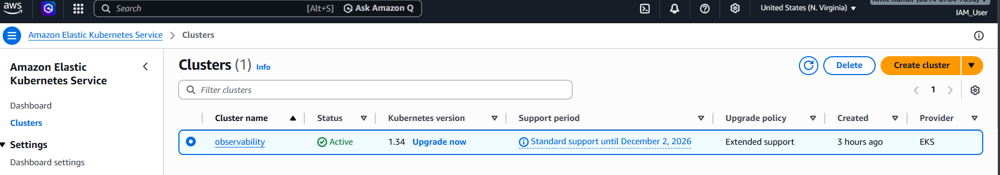
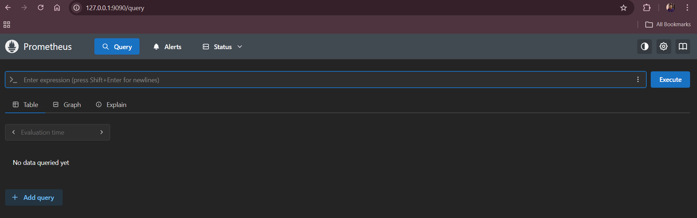
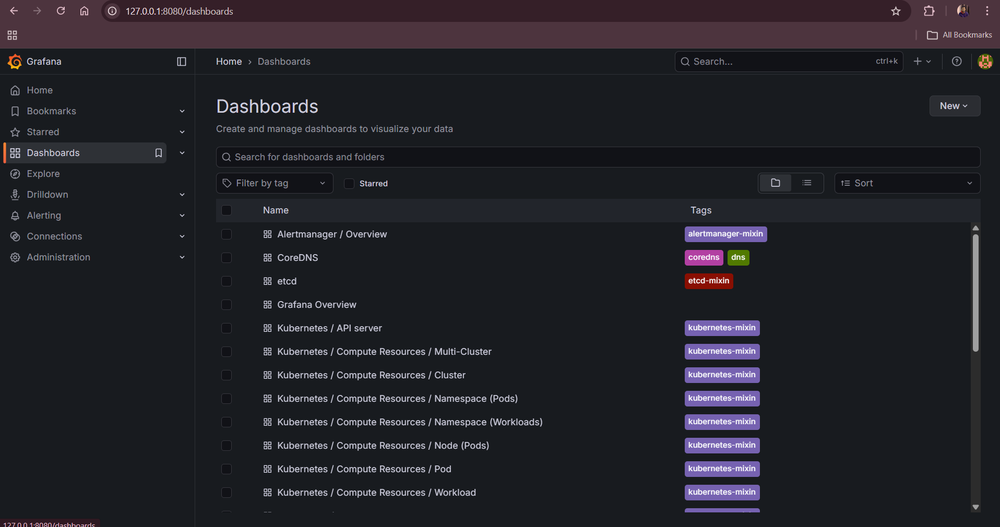
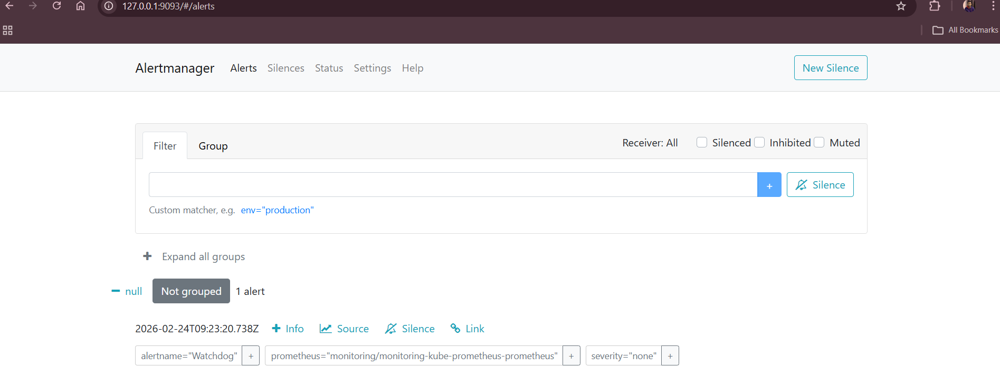

# EKS Monitoring with Prometheus & Grafana

## Project Overview
This project implements a Kubernetes monitoring setup on Amazon EKS using Prometheus, Grafana, and Alertmanager deployed via Helm

The setup includes:
- Prometheus for metrics collection
- Grafana for visualization
- Alertmanager for alert handling
- kube-prometheus-stack for simplified deployment

## Tech Stack

- Amazon EKS
- Kubernetes
- Helm
- Prometheus
- Grafana
- Alertmanager
- AWS CLI (configured with IAM permissions)
- eksctl

## Architecture

- Amazon EKS Cluster
- Managed Node Group (t3.medium)
- Monitoring Namespace
- kube-prometheus-stack deployed via Helm
- Prometheus scraping cluster metrics
- Grafana connected to Prometheus as datasource
- Alertmanager handling alerts

## Cost Consideration

EKS is a paid service. Ensure that you delete the cluster and related resources after testing to avoid unnecessary AWS charges.

## Key Learnings

- Setting up EKS cluster using eksctl
- Configuring IAM OIDC provider
- Deploying Helm charts in Kubernetes
- Understanding Prometheus scraping mechanism
- Exposing services using kubectl port-forward
- Managing cloud costs and cleaning up resources

## Observability
Observability is the ability to understand the internal state of a system by analyzing the data it produces, including logs, metrics, and traces.

## Metrics
Metrics are measurements or data points that tell you what is happening.
**For example:** the number of steps you walk each day, your heart rate, or the temperature outside - these are all metrics.

## Monitoring
Monitoring is the process of keeping an eye on these metrics over time to understand what's normal, identify changes, and detect problems. It's like watching your step count daily to see if you're meeting your fitness goal or checking your heart rate to make sure it's in a healthy range.

---

## Prometheus
- Prometheus is an open-source systems monitoring and alerting toolkit originally built at SoundCloud.

- It is known for its robust data model, powerful query language (PromQL), and the ability to generate alerts based on the collected time-series data.

- It can be configured and set up on both bare-metal servers and container environments like Kubernetes.

---

## Alertmanager

- The Alertmanager is responsible for managing alerts generated by the Prometheus server.

- It takes care of deduplicating, grouping, and routing alerts to the appropriate notification channels such as PagerDuty, email, or Slack.


## Grafana
- Grafana is a powerful dashboard and visualization tool that integrates with Prometheus to provide rich, customizable visualizations of the metrics data.

# Installation & Configuration
## Step 1: Create EKS Cluster

### Prerequisites
- Download and install AWS CLI
- Setup and configure AWS CLI using the `aws configure` command
- Install and configure eksctl
- Install and configure kubectl

```
eksctl create cluster --name=observability \
                      --region=us-east-1 \
                      --zones=us-east-1a,us-east-1b \
                      --without-nodegroup
```

```
eksctl utils associate-iam-oidc-provider \
    --region us-east-1 \
    --cluster observability \
    --approve
```

```
eksctl create nodegroup --cluster=observability \
                        --region=us-east-1 \
                        --name=observability-ng-private \
                        --node-type=t3.medium \
                        --nodes-min=2 \
                        --nodes-max=3 \
                        --node-volume-size=20 \
                        --managed \
                        --asg-access \
                        --external-dns-access \
                        --full-ecr-access \
                        --appmesh-access \
                        --alb-ingress-access \
                        --node-private-networking

# Update ./kube/config file
aws eks update-kubeconfig --name observability
```


## Step 2: Install Kube-prometheus-stack

```
helm repo add prometheus-community https://prometheus-community.github.io/helm-charts
helm repo update
```

## Step 3: Deploy the chart into a new namespace "monitoring"

**Clone this repository:**
```
git clone https://github.com/Amitkushwaha7/eks-prometheus-grafana.git
cd eks-prometheus-grafana
```

**Create monitoring namespace:**
```
kubectl create ns monitoring
```

**Deploy kube-prometheus-stack:**
```
helm install monitoring prometheus-community/kube-prometheus-stack \
-n monitoring \
-f ./custom_kube_prometheus_stack.yml
```

## Step 4: Verify the Installation

```
kubectl get all -n monitoring
```
- **Prometheus UI:**

```
kubectl port-forward service/prometheus-operated -n monitoring 9090:9090
```



**NOTE:** If you are using an EC2 instance or Cloud VM, you need to pass `--address 0.0.0.0` to the above command. Then you can access the UI on `instance-ip:port`

- **Grafana UI:** 

```
kubectl port-forward service/monitoring-grafana -n monitoring 8080:80
```



- **Alertmanager UI:**

```
kubectl port-forward service/alertmanager-operated -n monitoring 9093:9093
```



## Step 5: Clean Up

- **Uninstall Helm chart:**

```
helm uninstall monitoring --namespace monitoring
```

- **Delete namespace:**

```
kubectl delete ns monitoring
```

- **Delete cluster and all resources:**

```
eksctl delete cluster --name observability
```